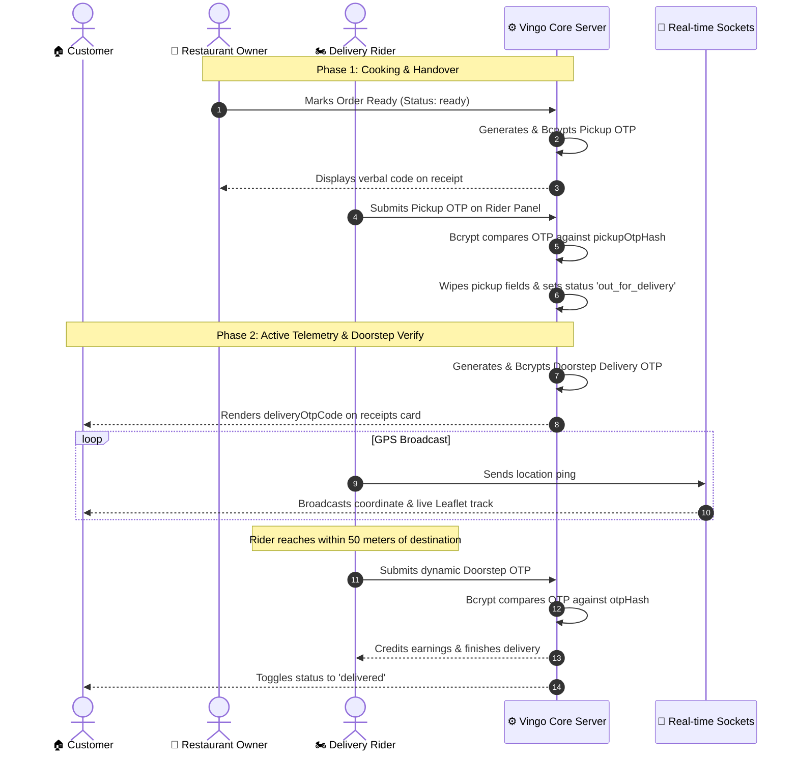

# 🛵 Vingo — Master Repository

Welcome to **Vingo**, a premium, high-fidelity MERN-stack on-demand food delivery platform. 

This repository contains two main parts:
* **[frontend](file:///Users/rohit/Desktop/vingo/frontend)**: Vite + React frontend web application with Leaflet dynamic satellite tracks and glassmorphic dashboards.
* **[backend](file:///Users/rohit/Desktop/vingo/backend)**: Express + Socket.IO REST and Real-Time Gateway Server with proximity gating and cryptographic verification.

---

## 🏗️ System Flow & Two-Stage Handshake Verification

Vingo provides top-tier security for the delivery pipeline using two separate cryptographic OTP verification stages backed by one-way **Bcrypt hashes**:



For comprehensive features list, database schemas, Leaflet tracking, allocation rules, and visual specifications, see the detailed guides inside the directories:
* **Frontend Guide**: [frontend/README.md](file:///Users/rohit/Desktop/vingo/frontend/README.md)
* **Backend Architecture**: Check out [backend/src/modules/](file:///Users/rohit/Desktop/vingo/backend/src/modules/)

---

## 🚀 Step-by-Step Local Setup

### 1. Backend Server Setup
1. Enter backend folder:
   ```bash
   cd backend
   ```
2. Install libraries:
   ```bash
   npm install
   ```
3. Set your environment variables in a local `.env` file:
   ```env
   PORT=3004
   MONGO_URI=mongodb+srv://your-atlas-uri-here
   JWT_SECRET=your_jwt_secret_key_here
   NODE_ENV=development
   ```
4. Start backend:
   ```bash
   npm run dev
   ```

### 2. Frontend React Webapp Setup
1. Enter frontend folder:
   ```bash
   cd ../frontend
   ```
2. Install packages:
   ```bash
   npm install
   ```
3. Boot development bundle:
   ```bash
   npm run dev
   ```
4. Access app at `http://localhost:5173`.
