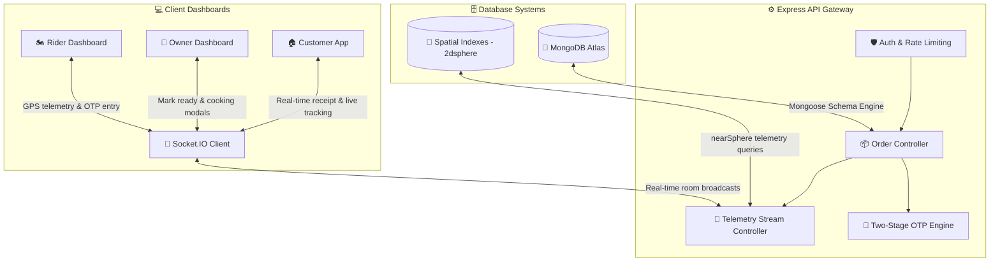
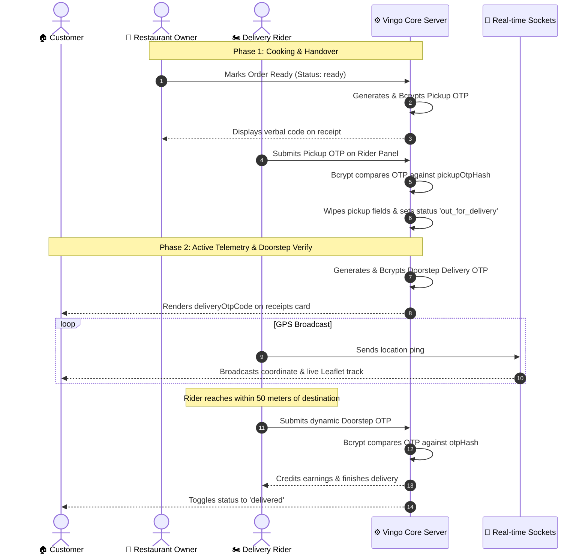

# 🛵 Vingo — Premium On-Demand Food Delivery Platform

Vingo is a state-of-the-art, premium on-demand food delivery platform built with a high-fidelity **MERN (MongoDB, Express, React, Node.js)** architecture. It features secure **two-stage cryptographic handover verification**, real-time **high-precision GPS telemetry streaming** over WebSockets, intelligent **proximity-based courier allocation**, and a visually stunning, glassmorphic design system.

---

## 🏗️ System Architecture & Telemetry Flow



---

## 🔑 Two-Stage Cryptographic OTP Handover Flow

Vingo secures the entire delivery lifecycle through two distinct, time-gated verification handshakes using cryptographically secure random codes and one-way **Bcrypt hashing**:

### 1. 🏪 Restaurant Handover (Pickup OTP)
* **Trigger**: The restaurant owner completes preparation and clicks **Mark Ready** on their dashboard.
* **Generation**: The Vingo backend generates a secure 6-digit random code, hashes it with bcrypt into `pickupOtpHash`, and sets an expiration timestamp. The plain-text code is securely saved into `pickupOtpCode` for immediate display on the restaurant's order receipt panel.
* **Verification**: When the delivery rider arrives at the kitchen, they request this handover code and enter it on their device. Vingo verifies the entry using `bcrypt.compare` against `pickupOtpHash`. Upon matching, the order transitions to `out_for_delivery` and pickup fields are wiped.

### 2. 🏠 Doorstep Delivery (Drop-off OTP)
* **Trigger**: Verification of the Pickup OTP automatically generates a second unique 6-digit code.
* **Generation**: The backend hashes this new code into `otpHash` and displays the plain-text value in the Customer's order receipts tracking panel as `deliveryOtpCode`.
* **Proximity Gating**: When the rider simulates driving close to the customer's coordinates (within **50 meters**), the GPS proximity triggers an OTP input modal on the rider's screen.
* **Verification**: The rider verbally requests the code from the customer and enters it. The backend verifies it against `otpHash`, credits the courier's earnings, adds customer loyalty points, and transitions the order status to `delivered`.



---

## 🌟 Advanced Technical Features

### 📡 High-Precision GPS Telemetry & Kalman Smoothing
* The rider dashboard broadcasts coordinates via WebSocket `gps_ping` frames.
* The socket handler performs coordinates smoothing to filter out cellular/network telemetry noise before computing exact Mapbox distance vectors.
* Emits dynamic ETA updates on the fly to keep the customer informed.

### 🗺️ Dynamic Proximity-Based Allocation Engine
* Uses MongoDB `2dsphere` geospatial indexing to query online, idle riders in a **3km radius** using `$nearSphere`.
* Computes composite matching weights using distance, courier ratings, and completion speed metrics to assign the most optimal courier.
* Incorporates concurrent atomic locks to prevent double-allocation race conditions.

### ⏱️ Glassmorphic Cooking Prep-Time Selectors
* Fully custom glassmorphic modals that replace basic browser alerts.
* Features one-click cooking duration shortcuts (`15m`, `20m`, `30m`, `45m`, `60m`) along with a manual input field, integrated with premium visual feedback and state transitions.

### 🔔 Beautiful Toast Notification System
* Wiped out **100% of standard browser alert alerts** across the codebase.
* Replaced them with glassmorphic (`backdrop-blur-xl border border-white/30 rounded-2xl shadow-2xl`) contextual toast alerts supporting Success, Info, Warning, and Error messages, complete with micro-animated timeline progress loaders.

### 📊 Fail-Safe Review & Average Rating Engine
* Automatically recalculates restaurant average ratings (`avgRating`) and total review counts upon customer feedback.
* Executes inside a robust, isolated transaction wrapper to prevent database locks or failures during concurrently running active tracking loops.

---

## 🛠️ Technology Stack & Libraries

### Frontend (Client Layer)
* **Core**: React v18 (Vite Bundler & HMR)
* **Mapping**: Leaflet + OpenStreetMap (Interactive maps, dynamic custom rider icons, telemetry tracks)
* **Icons**: React-Icons (Fi / Io5 Packs)
* **HTTP Client**: Axios (with Credentials interceptors)
* **Sockets**: Socket.IO Client (Real-time duplex synchronization)
* **Styling**: Modern CSS with Glassmorphism, HSL tailormade variables, premium backdrop-filters, and animate-in layers.

### Backend (Server Layer)
* **Runtime**: Node.js + Express
* **Database**: MongoDB Atlas + Mongoose
* **Sockets**: Socket.IO Server (Room namespaces, event routing)
* **Security**: JSON Web Tokens (JWT), Bcrypt password hashing, Helmet, CORS
* **Telemetry**: Turf.js (Geospatial calculations)
* **Rate Limiting**: Express Rate Limit (Dynamic threshold adjustment for seamless development workflows)

---

## 🚀 Installation & Local Development Setup

### ⚙️ Prerequisites
* **Node.js**: v18+ or v20+
* **MongoDB**: A running local MongoDB instance or a remote Atlas Connection URI

---

### 1. Backend Setup
1. Navigate to the backend directory:
   ```bash
   cd backend
   ```
2. Install dependencies:
   ```bash
   npm install
   ```
3. Create a `.env` file in the backend root and specify your variables:
   ```env
   PORT=3004
   MONGO_URI=mongodb+srv://your-atlas-uri-here
   JWT_SECRET=your_jwt_secret_key_here
   NODE_ENV=development
   ```
4. Start the backend development server:
   ```bash
   npm run dev
   ```
   *The API gateway will launch on port `3004`.*

---

### 2. Frontend Setup
1. Navigate to the frontend directory:
   ```bash
   cd ../frontend
   ```
2. Install dependencies:
   ```bash
   npm install
   ```
3. Verify or set your backend server connection endpoint in `src/App.jsx` (typically maps to `http://localhost:3004`).
4. Start the Vite React development server:
   ```bash
   npm run dev
   ```
5. Open your browser and navigate to `http://localhost:5173`.

---

### 📦 Production Compiling
To bundle the frontend for production deployment:
```bash
cd frontend
npm run build
```
*Compiles down to static assets inside `/dist`.*
